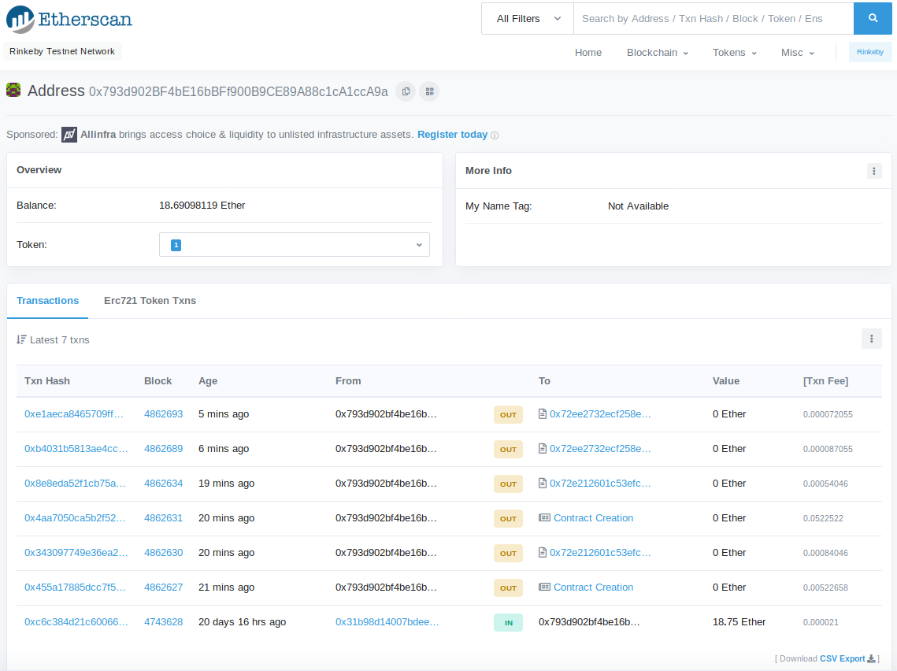
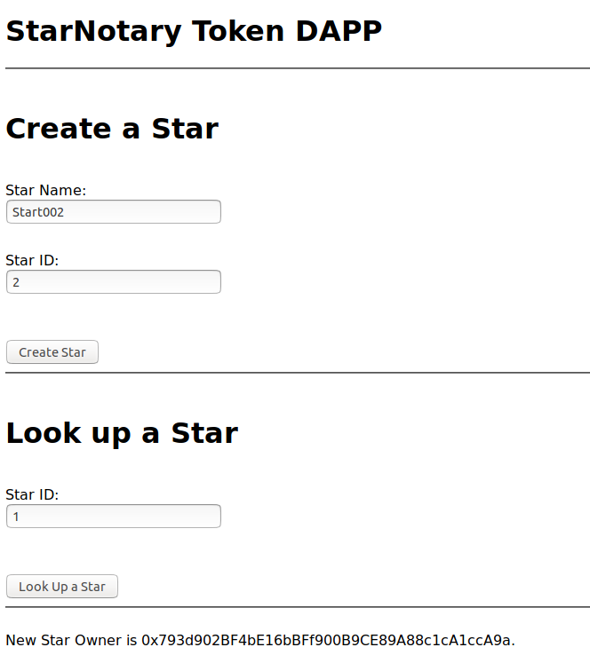
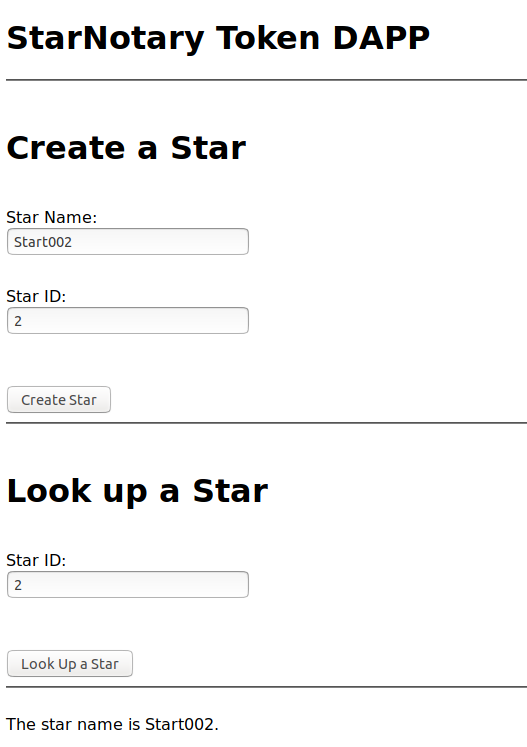
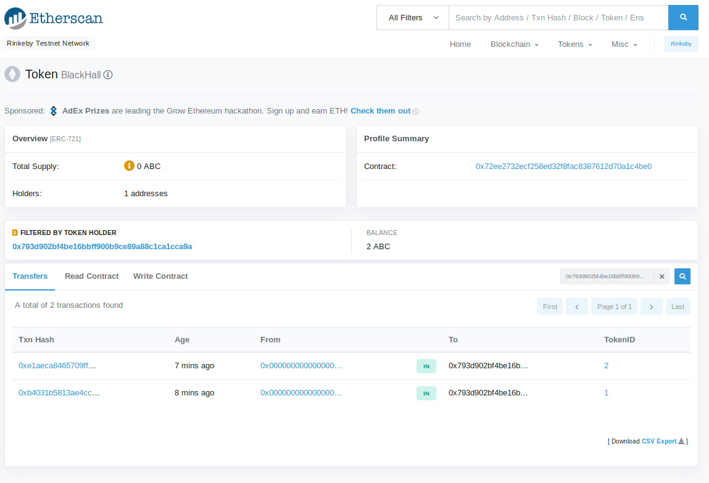

# Project Report

This is the project to build CryptoStar Dapp on Ethereum(ERC-721).

## Project environment

### module versions

**truffle(develop)> version**

- Truffle v5.0.30 (core: 5.0.30)
- Solidity v0.5.0 (solc-js)
- Node v10.15.1
- Web3.js v^1.2.0

**npm ls**

- openzeppelin-solidity v2.3.0
- truffle-hdwallet-provider v1.0.15

**ERC721 Token**

- Token Name : 'BlackHall'
- Token Symbol : 'ABC'

**GitHub**

https://github.com/HajimeK/BlockchainDevND/tree/master/projects/project_5


### Setup and Prepare

>   sudo npm install -g truffl
>   sudo chmod 777 ./.config/truffle/
>   sudo chmod 777 ./.config/truffle/config.json 
>   sudo npm install -g truffle
>   truffle -v
>   Truffle v5.0.30 - a development framework for Ethereum 

>   mkdir starNotaryv1
>   cd startNotaryv1
>   

truffle-hdwallet-provider and openzeppelin-solidity dependencies are installed. If not you can always install it with the commands:

>    npm install --save truffle-hdwallet-provider
>    npm install --save openzeppelin-solidity

### Develop
See the following files.
 - ./app/src/index.html
 - ./app/src/index.js
 - ./contracts/StarNotary.sol

### Run unit tests in the local network

For starting the development console, run:

>    truffle develop

For compiling the contract, inside the development console, run:

>    compile

 For migrating the contract to the locally running Ethereum network, inside the development console, run:

 >   migrate --reset

For running unit tests the contract, inside the development console, run:

>    test

## Deploy to Rinkeby test network.

Updated *truffle-config.js* to include the following
```JavaScript
    Rinkeby: {
      provider: () => new HDWalletProvider(mnemonic, `https://rinkeby.infura.io/v3/${infuraKey}`),
      network_id: 4,       // Rinkeby's id
      gas: 4500000,        // Ropsten has a lower block limit than mainnet
      confirmations: 2,    // # of confs to wait between deployments. (default: 0)
      timeoutBlocks: 200,  // # of blocks before a deployment times out  (minimum/default: 50)
      //skipDryRun: true     // Skip dry run before migrations? (default: false for public nets )
   },
```

Created a *.secret* file to include the mnemonik in MetaMask.

Then run below to deploy to Rinkeby
>    truffle migrate --reset --network Rinkeby

We can see the contract deployment and succeeding transactions as below.



## Work on the Rinkeby test network

For running the Front End of the DAPP, open another terminal window and go inside the project directory, and run:
>   cd app
>   npm run dev

This will launch local server to request to Rinkeby test network.
Open *http://localhost:8080* to open the front application.

Create start with below, for example,
Start Name: Start002, id 2 was created in Rinkeby test network.



Than look up the star just created.



You can see the tokens in Rinkeby.

https://rinkeby.etherscan.io/token/0x72ee2732ecf258ed32f8fac8387612d70a1c4be0?a=0x793d902bf4be16bbff900b9ce89a88c1ca1cca9a

