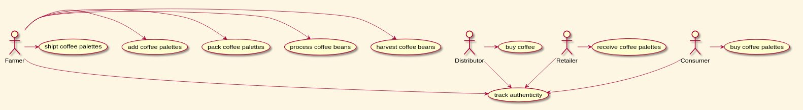
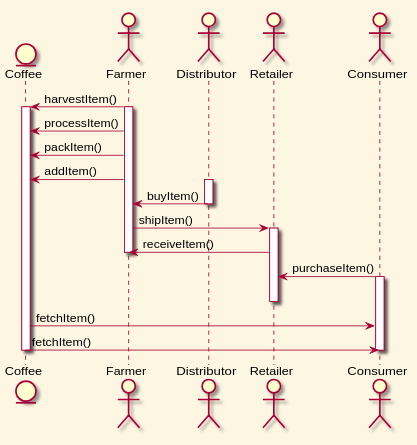
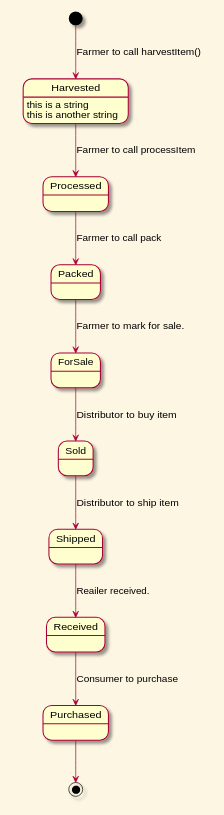
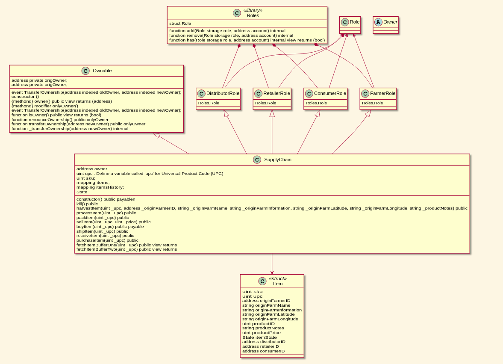

# Ethereum Dapp for Tracking Items through Suuply Chain

Learn lower level components of establishing a sound web service architecture using Blockchain.
This document is the project execution report, including design in UML, contract tests, test network deployment, and front end tests.

# Part 1 : Plan the project with write-ups

## Requirement 1: Project write-up - UML

### Use Case



```plantuml
:Farmer:
:Distributor:
:Retailer:
:Consumer:

Farmer -> (harvest coffee beans)
Farmer -> (process coffee beans)
Farmer -> (pack coffee palettes)
Farmer -> (add coffee palettes)
Farmer -> (shipt coffee palettes)
Farmer -down-> (track authenticity)

Distributor -> (buy coffee)
Distributor -down-> (track authenticity)

Retailer -> (receive coffee palettes)
Retailer -down-> (track authenticity)

Consumer -> (buy coffee palettes)
Consumer -down-> (track authenticity)
```

### Seuquence Diagram



```plantuml
entity Coffee
actor Farmer
actor Distributor
actor Retailer
actor Consumer

Farmer -> Coffee : harvestItem()
   activate Farmer
   activate Coffee
Farmer -> Coffee : processItem()
Farmer -> Coffee : packItem()
Farmer -> Coffee : addItem()
   activate Distributor
Distributor -> Farmer : buyItem()
   deactivate Distributor
Farmer -> Retailer : shipItem()
   activate Retailer
Retailer -> Farmer : receiveItem()
   deactivate Farmer
Consumer -> Retailer : purchaseItem()
   activate Consumer
   deactivate Retailer
Coffee -> Consumer : fetchItem()
Coffee -> Consumer : fetchItem()
   deactivate Consumer
   deactivate Coffee
```

### State Diagram



```plantuml
[*] -down-> Harvested : Farmer to call harvestItem()
Harvested -down-> Processed : Farmer to call processItem
Processed -down-> Packed : Farmer to call pack
Packed -down-> ForSale : Farmer to mark for sale.
ForSale -down-> Sold : Distributor to buy item
Sold -down-> Shipped : Distributor to ship item
Shipped -down-> Received : Reailer received.
Received -down-> Purchased : Consumer to purchase
Purchased -down-> [*]


Harvested : this is a string
Harvested : this is another string
```

### Class Diagram


```plantuml

Class SupplyChain {
    {field} address owner
    {field} uint upc : Define a variable called 'upc' for Universal Product Code (UPC)
    {field} uint  sku;
    {field} mapping  items;
    {field} mapping  itemsHistory;
    {field} State
    {method} constructor() public payablen
    {method}kill() public
    {method}harvestItem(uint _upc, address _originFarmerID, string _originFarmName, string _originFarmInformation, string  _originFarmLatitude, string  _originFarmLongitude, string  _productNotes) public
    {method}processItem(uint _upc) public
    {method}packItem(uint _upc) public
    {method}sellItem(uint _upc, uint _price) public
    {method}buyItem(uint _upc) public payable
    {method}shipItem(uint _upc) public
    {method}receiveItem(uint _upc) public
    {method}purchaseItem(uint _upc) public
    {method}fetchItemBufferOne(uint _upc) public view returns
    {method}fetchItemBufferTwo(uint _upc) public view returns
}

Class Item <<struct>> {
    uint    sku
    uint    upc
    address originFarmerID
    string  originFarmName
    string  originFarmInformation
    string  originFarmLatitude
    string  originFarmLongitude
    uint    productID
    string  productNotes
    uint    productPrice
    State   itemState
    address distributorID
    address retailerID
    address consumerID
}


Class Ownable {
    {field}  address private origOwner;
    {method} event TransferOwnership(address indexed oldOwner, address indexed newOwner);
    {method} constructor ()
    {methond} owner() public view returns (address)
    {methond} modifier onlyOwner()
    {field}address private origOwner;
    {method} event TransferOwnership(address indexed oldOwner, address indexed newOwner);
    {method} function isOwner() public view returns (bool)
    {method} function renounceOwnership() public onlyOwner 
    {method} function transferOwnership(address newOwner) public onlyOwner
    {method} function _transferOwnership(address newOwner) internal
}

FarmerRole <|-- SupplyChain
DistributorRole <|-- SupplyChain
RetailerRole <|-- SupplyChain
ConsumerRole <|-- SupplyChain
Ownable <|-down- SupplyChain

Class Roles <<library>> {
  {field} struct Role
  {method} function add(Role storage role, address account) internal
  {method} function remove(Role storage role, address account) internal
  {method} function has(Role storage role, address account) internal view returns (bool)
}

Class FarmerRole {
    {field} Roles.Role
}
Class DistributorRole {
    {field} Roles.Role
}
Class RetailerRole {
    {field} Roles.Role
}
Class ConsumerRole {
    {field} Roles.Role
}

Role <-- FarmerRole
Role <-- DistributorRole
Role <-- RetailerRole
Role <-- ConsumerRole

Roles *-- FarmerRole
Roles *-- DistributorRole
Roles *-- RetailerRole
Roles *-- ConsumerRole

SupplyChain -down-> Item

```


## Requirement 2: Project write-up - Libraries

- Truffle v5.0.31 (core: 5.0.31)
- Node v10.16.2
- npm install --save truffle-hdwallet-provider

## Requirement 3: Project write-up - IPFS

NA

# Part 2 : Write smart contracts

GitHub Repository (https://github.com/HajimeK/BlockchainDevND/tree/master/projects/project_6_Supply_Chain/project/contracts)

## Part 3: Test smart contract code coverage

### Requirement: Smart contract has associated tests
For this project, as with any project, make sure to test your smart contracts to ensure they are working properly in different situations without any risk.


### Requirement: Smart contract has associated tests
At minimum, test every function for every function you implemented from your Sequence Diagram. For example, from this Sequence Diagram we would need to test 10 functions:

harvestItem()
processItem()
packItem()
addItem()
buyItem()
shiptItem()
receiveItem()
purchaseItem()
fetchItemBufferOne()
fetchItemBufferTwo()


<br>


<br>


```bash
(base) hajime@hajime-DAIV-NG5800:~/git/BlockchainDevND/projects/project_6_Supply_Chain/project$ truffle develop
Warning: Both truffle-config.js and truffle.js were found. Using truffle-config.js.
Truffle Develop started at http://127.0.0.1:8545/

Accounts:
(0) 0xd63378790242a416e309e76fe8f96b2e2f06c6f1
(1) 0x63e8b404ec719cca3f8fac31a31982d6bfb66370
(2) 0xaba5a03f37a519f53acce9c711c065e2ca560e5a
(3) 0xa71e4e3b0abd326f4b57f29da4d04fcaf0b52269
(4) 0x5329ca87ba64ff65fd00158917408b6149a13847
(5) 0x7f53c857706928d2bd3359957bb707cfd60dc398
(6) 0xfef059ef3b3da4c852fcabbcdf85afb43f660011
(7) 0xf36147f282e286796899b3a2befc88e620057d32
(8) 0xf9d61adff34dd3542c7c2e4b93cde312828c9e1a
(9) 0x8c85afc0319a974c89f5069cf5c3d4da16d66757

Private Keys:
(0) 045ebad8e0b639ba365dc0cec7af9dc16528689000b28a60788f21ca14a6b413
(1) 8d36e1b5a816797aa34629e0a670b16789b5918bf8a9a0a4200395164e85ef5f
(2) 5240fe5460e0006843c0358f267331cda311bc686e523ccfb0b354f55b609207
(3) a8aae929c927ac3b41f595c6e81ab8a4ded86faebf0db793a05796003fa3b043
(4) d4f34a15ee326ab01048e970eac89eab72e4af57b42c4c055225663676ee976c
(5) c62b26be8d7bcbc85294a60a58ee82fc3ba75571c724ad92f42b494033191fad
(6) 17f208fb82801d1dd8513af791d356f8b024f4dbdcf5eb736c95984c021af77d
(7) 84d5f7917d0c28d7a831c0206c93f8477a3be1c6013418180bb66d239dfedba0
(8) c0c409da277f49ba65eb565603dc0791562dc5774528c085930a22fff7de93d7
(9) 04cd8f303798d24298b2abcff162227c406b055b1d9dd7e6301b8b0ee8fb7b4c

Mnemonic: chalk admit express filter velvet addict finger clump feel swap note choose

⚠️  Important ⚠️  : This mnemonic was created for you by Truffle. It is not secure.
Ensure you do not use it on production blockchains, or else you risk losing funds.

truffle(develop)> test
Warning: Both truffle-config.js and truffle.js were found. Using truffle-config.js.
Using network 'develop'.


Compiling your contracts...
===========================
> Everything is up to date, there is nothing to compile.

Config {
  _deepCopy: [ 'compilers' ],
  _values:
   { truffle_directory: '/usr/local/lib/node_modules/truffle',
     working_directory:
      '/home/hajime/git/BlockchainDevND/projects/project_6_Supply_Chain/project',
     network: 'develop',
     networks: { develop: [Object] },
     verboseRpc: false,
     gas: null,
     gasPrice: null,
     from: null,
     confirmations: 0,
     timeoutBlocks: 0,
     production: false,
     skipDryRun: false,
     build: null,
     resolver:
      TestResolver {
        resolver: [Resolver],
        source: [TestSource],
        search_path: '/tmp/test-119723-1573-5hcosk.yw444',
        seen: [],
        require_cache: {},
        cache_on: false },
     artifactor:
      Artifactor { destination: '/tmp/test-119723-1573-5hcosk.yw444' },
     ethpm:
      { ipfs_host: 'ipfs.infura.io',
        ipfs_protocol: 'https',
        registry: '0x8011df4830b4f696cd81393997e5371b93338878',
        install_provider_uri: 'https://ropsten.infura.io/truffle' },
     compilers: { solc: [Object], vyper: {} },
     logger:
      Console {
        log: [Function: bound consoleCall],
        debug: [Function: bound consoleCall],
        info: [Function: bound consoleCall],
        dirxml: [Function: bound consoleCall],
        warn: [Function],
        error: [Function: bound consoleCall],
        dir: [Function: bound consoleCall],
        time: [Function: bound consoleCall],
        timeEnd: [Function: bound consoleCall],
        timeLog: [Function: bound timeLog],
        trace: [Function: bound consoleCall],
        assert: [Function: bound consoleCall],
        clear: [Function: bound consoleCall],
        count: [Function: bound consoleCall],
        countReset: [Function: bound consoleCall],
        group: [Function: bound consoleCall],
        groupCollapsed: [Function: bound consoleCall],
        groupEnd: [Function: bound consoleCall],
        table: [Function: bound consoleCall],
        Console: [Function: Console],
        markTimeline: [Function: markTimeline],
        profile: [Function: profile],
        profileEnd: [Function: profileEnd],
        timeline: [Function: timeline],
        timelineEnd: [Function: timelineEnd],
        timeStamp: [Function: timeStamp],
        context: [Function: context],
        [Symbol(counts)]: Map {},
        [Symbol(kColorMode)]: 'auto' },
     build_directory:
      '/home/hajime/git/BlockchainDevND/projects/project_6_Supply_Chain/project/build',
     contracts_directory:
      '/home/hajime/git/BlockchainDevND/projects/project_6_Supply_Chain/project/contracts',
     contracts_build_directory: '/tmp/test-119723-1573-5hcosk.yw444',
     migrations_directory:
      '/home/hajime/git/BlockchainDevND/projects/project_6_Supply_Chain/project/migrations',
     migrations_file_extension_regexp: /^\.(js|es6?)$/,
     test_directory:
      '/home/hajime/git/BlockchainDevND/projects/project_6_Supply_Chain/project/test',
     test_file_extension_regexp: /.*\.(js|ts|es|es6|jsx|sol)$/,
     example_project_directory: '/usr/local/lib/node_modules/truffle/example' },
  truffle_directory: '/usr/local/lib/node_modules/truffle',
  working_directory:
   '/home/hajime/git/BlockchainDevND/projects/project_6_Supply_Chain/project',
  network: 'develop',
  networks:
   { develop:
      { network_id: 5777,
        provider: [Function: provider],
        from: '0xd63378790242A416e309e76FE8F96B2E2F06C6f1' } },
  verboseRpc: false,
  build: null,
  resolver:
   Resolver {
     options:
      Config {
        _deepCopy: [Array],
        _values: [Object],
        truffle_directory: [Getter/Setter],
        working_directory: [Getter/Setter],
        network: [Getter/Setter],
        networks: [Getter/Setter],
        verboseRpc: [Getter/Setter],
        build: [Getter/Setter],
        resolver: [Getter/Setter],
        artifactor: [Getter/Setter],
        ethpm: [Getter/Setter],
        logger: [Getter/Setter],
        compilers: [Getter/Setter],
        build_directory: [Getter/Setter],
        contracts_directory: [Getter/Setter],
        contracts_build_directory: [Getter/Setter],
        migrations_directory: [Getter/Setter],
        migrations_file_extension_regexp: [Getter/Setter],
        test_directory: [Getter/Setter],
        test_file_extension_regexp: [Getter/Setter],
        example_project_directory: [Getter/Setter],
        network_id: [Getter/Setter],
        network_config: [Getter/Setter],
        from: [Getter/Setter],
        gas: [Getter/Setter],
        gasPrice: [Getter/Setter],
        provider: [Getter/Setter],
        confirmations: [Getter/Setter],
        production: [Getter/Setter],
        timeoutBlocks: [Getter/Setter],
        mocha: [Object],
        _: [],
        log: false },
     sources: [ [EPM], [NPM], GlobalNPM {}, [FS] ] },
  artifactor:
   Artifactor { destination: '/tmp/test-119723-1573-5hcosk.yw444' },
  ethpm:
   { ipfs_host: 'ipfs.infura.io',
     ipfs_protocol: 'https',
     registry: '0x8011df4830b4f696cd81393997e5371b93338878',
     install_provider_uri: 'https://ropsten.infura.io/truffle' },
  logger:
   Console {
     log: [Function: bound consoleCall],
     debug: [Function: bound consoleCall],
     info: [Function: bound consoleCall],
     dirxml: [Function: bound consoleCall],
     warn: [Function],
     error: [Function: bound consoleCall],
     dir: [Function: bound consoleCall],
     time: [Function: bound consoleCall],
     timeEnd: [Function: bound consoleCall],
     timeLog: [Function: bound timeLog],
     trace: [Function: bound consoleCall],
     assert: [Function: bound consoleCall],
     clear: [Function: bound consoleCall],
     count: [Function: bound consoleCall],
     countReset: [Function: bound consoleCall],
     group: [Function: bound consoleCall],
     groupCollapsed: [Function: bound consoleCall],
     groupEnd: [Function: bound consoleCall],
     table: [Function: bound consoleCall],
     Console: [Function: Console],
     markTimeline: [Function: markTimeline],
     profile: [Function: profile],
     profileEnd: [Function: profileEnd],
     timeline: [Function: timeline],
     timelineEnd: [Function: timelineEnd],
     timeStamp: [Function: timeStamp],
     context: [Function: context],
     [Symbol(counts)]: Map {},
     [Symbol(kColorMode)]: 'auto' },
  compilers: { solc: { settings: [Object] }, vyper: {} },
  build_directory:
   '/home/hajime/git/BlockchainDevND/projects/project_6_Supply_Chain/project/build',
  contracts_directory:
   '/home/hajime/git/BlockchainDevND/projects/project_6_Supply_Chain/project/contracts',
  contracts_build_directory: '/tmp/test-119723-1573-5hcosk.yw444',
  migrations_directory:
   '/home/hajime/git/BlockchainDevND/projects/project_6_Supply_Chain/project/migrations',
  migrations_file_extension_regexp: /^\.(js|es6?)$/,
  test_directory:
   '/home/hajime/git/BlockchainDevND/projects/project_6_Supply_Chain/project/test',
  test_file_extension_regexp: /.*\.(js|ts|es|es6|jsx|sol)$/,
  example_project_directory: '/usr/local/lib/node_modules/truffle/example',
  network_id: 5777,
  network_config:
   { gas: 6721975,
     gasPrice: 20000000000,
     from: '0xd63378790242A416e309e76FE8F96B2E2F06C6f1',
     network_id: 5777,
     provider: [Function: provider] },
  from: '0xd63378790242A416e309e76FE8F96B2E2F06C6f1',
  gas: 6721975,
  gasPrice: 20000000000,
  provider:
   HttpProvider {
     host: 'http://127.0.0.1:8545/',
     httpAgent:
      Agent {
        domain: [Domain],
        _events: [Object],
        _eventsCount: 1,
        _maxListeners: undefined,
        defaultPort: 80,
        protocol: 'http:',
        options: [Object],
        requests: {},
        sockets: {},
        freeSockets: {},
        keepAliveMsecs: 1000,
        keepAlive: false,
        maxSockets: Infinity,
        maxFreeSockets: 256 },
     timeout: 0,
     headers: undefined,
     connected: false,
     send: [Function],
     _alreadyWrapped: true },
  confirmations: undefined,
  production: undefined,
  timeoutBlocks: undefined,
  mocha: { useColors: true, reporterOptions: undefined },
  _: [],
  log: false,
  noAliases: true,
  repl:
   ReplManager {
     domain: null,
     _events: [Object: null prototype] { exit: [Function] },
     _eventsCount: 1,
     _maxListeners: undefined,
     options:
      Config {
        _deepCopy: [Array],
        _values: [Object],
        truffle_directory: '/usr/local/lib/node_modules/truffle',
        working_directory:
         '/home/hajime/git/BlockchainDevND/projects/project_6_Supply_Chain/project',
        network: 'develop',
        networks: [Object],
        verboseRpc: false,
        build: null,
        resolver: [Resolver],
        artifactor: [Artifactor],
        ethpm: [Object],
        logger: [Console],
        compilers: [Object],
        build_directory:
         '/home/hajime/git/BlockchainDevND/projects/project_6_Supply_Chain/project/build',
        contracts_directory:
         '/home/hajime/git/BlockchainDevND/projects/project_6_Supply_Chain/project/contracts',
        contracts_build_directory:
         '/home/hajime/git/BlockchainDevND/projects/project_6_Supply_Chain/project/build/contracts',
        migrations_directory:
         '/home/hajime/git/BlockchainDevND/projects/project_6_Supply_Chain/project/migrations',
        migrations_file_extension_regexp: /^\.(js|es6?)$/,
        test_directory:
         '/home/hajime/git/BlockchainDevND/projects/project_6_Supply_Chain/project/test',
        test_file_extension_regexp: /.*\.(js|ts|es|es6|jsx|sol)$/,
        example_project_directory: '/usr/local/lib/node_modules/truffle/example',
        network_id: 5777,
        network_config: [Object],
        from: '0xd63378790242A416e309e76FE8F96B2E2F06C6f1',
        gas: 6721975,
        gasPrice: 20000000000,
        provider: [HttpProvider],
        confirmations: undefined,
        production: undefined,
        timeoutBlocks: undefined,
        mocha: [Object],
        _: [],
        log: false,
        noAliases: true,
        repl: [Circular] },
     repl:
      REPLServer {
        _domain: [Domain],
        useGlobal: false,
        ignoreUndefined: undefined,
        replMode: Symbol(repl-sloppy),
        underscoreAssigned: false,
        last: undefined,
        underscoreErrAssigned: false,
        lastError: undefined,
        breakEvalOnSigint: false,
        editorMode: false,
        rli: [Circular],
        eval: [Function],
        inputStream: [ReadStream],
        outputStream: [WriteStream],
        context: [Object],
        lines: [Array],
        bufferedCommand: [Getter/Setter],
        completer: [Function: completer],
        _sawReturnAt: 1566528156489,
        isCompletionEnabled: true,
        _sawKeyPress: true,
        _previousKey: [Object],
        escapeCodeTimeout: 500,
        domain: null,
        _events: [Object],
        _eventsCount: 5,
        _maxListeners: undefined,
        output: [WriteStream],
        input: [ReadStream],
        historySize: 30,
        removeHistoryDuplicates: false,
        crlfDelay: 100,
        _initialPrompt: 'truffle(develop)> ',
        _prompt: 'truffle(develop)> ',
        terminal: true,
        line: '',
        cursor: 0,
        history: [Array],
        historyIndex: -1,
        commands: [Object],
        writer: [Function],
        useColors: true,
        parseREPLKeyword: [Function: deprecated],
        _ttyWrite: [Function],
        prevRows: 0,
        [Symbol(contextId)]: 3,
        [Symbol(bufferedCommand)]: '',
        [Symbol(line object stream)]: undefined },
     contexts: [ [Object] ] },
  'show-events': false,
  showEvents: false,
  test_files:
   [ '/home/hajime/git/BlockchainDevND/projects/project_6_Supply_Chain/project/test/TestSupplychain.js' ] }
ganache-cli accounts used here...
Contract Owner: accounts[0]  0xd63378790242A416e309e76FE8F96B2E2F06C6f1
Farmer: accounts[1]  0x63e8B404EC719CCA3F8fac31A31982D6bfb66370
Distributor: accounts[2]  0xaBa5a03F37a519F53acCE9C711c065E2Ca560E5A
Retailer: accounts[3]  0xa71e4E3B0AbD326F4b57F29Da4d04fCaf0B52269
Consumer: accounts[4]  0x5329cA87Ba64ff65fd00158917408B6149a13847


  Contract: SupplyChain
    ✓ setup (174ms)
    ✓ Testing smart contract function harvestItem() that allows a farmer to harvest coffee (101ms)
    ✓ Testing smart contract function processItem() that allows a farmer to process coffee (55ms)
    ✓ Testing smart contract function packItem() that allows a farmer to pack coffee (56ms)
    ✓ Testing smart contract function sellItem() that allows a farmer to sell coffee (55ms)
    ✓ Testing smart contract function buyItem() that allows a distributor to buy coffee (70ms)
    ✓ Testing smart contract function shipItem() that allows a distributor to ship coffee (51ms)
    ✓ Testing smart contract function receiveItem() that allows a retailer to mark coffee received (57ms)
    ✓ Testing smart contract function purchaseItem() that allows a consumer to purchase coffee (50ms)
    ✓ Testing smart contract function fetchItemBufferOne() that allows anyone to fetch item details from blockchain
    ✓ Testing smart contract function fetchItemBufferTwo() that allows anyone to fetch item details from blockchain


  11 passing (761ms)
```

## Part 4 : Deploy smart contracts on public test network


Updated *truffle-config.js* to include the following
```JavaScript
    Rinkeby: {
      provider: () => new HDWalletProvider(mnemonic, `https://rinkeby.infura.io/v3/${infuraKey}`),
      network_id: 4,       // Rinkeby's id
      gas: 4500000,        // Ropsten has a lower block limit than mainnet
      confirmations: 2,    // # of confs to wait between deployments. (default: 0)
      timeoutBlocks: 200,  // # of blocks before a deployment times out  (minimum/default: 50)
      //skipDryRun: true     // Skip dry run before migrations? (default: false for public nets )
   },
```

Created a *.secret* file to include the mnemonik in MetaMask.

Then run below to deploy to Rinkeby
>    truffle migrate --reset --network rinkeby

We can see the contract deployment and succeeding transactions as below.


### Requirement 1: Deploy smart contract on a public test network

Using Truffle framework, deploy your smart contract with the Rinkeby test network. Take note of your contract hash and address after successful deployment.

Tip: Refer to Infura screencast for assistance on deploying your smart contract with Infura and Truffle.

https://rinkeby.etherscan.io/address/0x793d902bf4be16bbff900b9ce89a88c1ca1cca9a


```basch
(base) hajime@hajime-DAIV-NG5800:~/git/BlockchainDevND/projects/project_6_Supply_Chain/project$ truffle migrate --reset --network Rinkeby
Warning: Both truffle-config.js and truffle.js were found. Using truffle-config.js.

Compiling your contracts...
===========================
> Everything is up to date, there is nothing to compile.

Warning: Both truffle-config.js and truffle.js were found. Using truffle-config.js.

Migrations dry-run (simulation)
===============================
> Network name:    'Rinkeby-fork'
> Network id:      4
> Block gas limit: 0x6acfc0


1_initial_migration.js
======================

   Deploying 'Migrations'
   ----------------------
   > block number:        4959545
   > block timestamp:     1566530090
   > account:             0x793d902BF4bE16bBFf900B9CE89A88c1cA1ccA9a
   > balance:             18.690488404
   > gas used:            246393
   > gas price:           2 gwei
   > value sent:          0 ETH
   > total cost:          0.000492786 ETH

   -------------------------------------
   > Total cost:         0.000492786 ETH


2_deploy_contracts.js
=====================

   Deploying 'FarmerRole'
   ----------------------
   > block number:        4959547
   > block timestamp:     1566530098
   > account:             0x793d902BF4bE16bBFf900B9CE89A88c1cA1ccA9a
   > balance:             18.689711098
   > gas used:            361630
   > gas price:           2 gwei
   > value sent:          0 ETH
   > total cost:          0.00072326 ETH


   Deploying 'DistributorRole'
   ---------------------------
   > block number:        4959548
   > block timestamp:     1566530105
   > account:             0x793d902BF4bE16bBFf900B9CE89A88c1cA1ccA9a
   > balance:             18.688937014
   > gas used:            387042
   > gas price:           2 gwei
   > value sent:          0 ETH
   > total cost:          0.000774084 ETH


   Deploying 'RetailerRole'
   ------------------------
   > block number:        4959549
   > block timestamp:     1566530112
   > account:             0x793d902BF4bE16bBFf900B9CE89A88c1cA1ccA9a
   > balance:             18.688163186
   > gas used:            386914
   > gas price:           2 gwei
   > value sent:          0 ETH
   > total cost:          0.000773828 ETH


   Deploying 'ConsumerRole'
   ------------------------
   > block number:        4959550
   > block timestamp:     1566530118
   > account:             0x793d902BF4bE16bBFf900B9CE89A88c1cA1ccA9a
   > balance:             18.687387438
   > gas used:            387874
   > gas price:           2 gwei
   > value sent:          0 ETH
   > total cost:          0.000775748 ETH


   Deploying 'SupplyChain'
   -----------------------
   > block number:        4959551
   > block timestamp:     1566530132
   > account:             0x793d902BF4bE16bBFf900B9CE89A88c1cA1ccA9a
   > balance:             18.67986043
   > gas used:            3763504
   > gas price:           2 gwei
   > value sent:          0 ETH
   > total cost:          0.007527008 ETH

   -------------------------------------
   > Total cost:         0.010573928 ETH


Summary
=======
> Total deployments:   6
> Final cost:          0.011066714 ETH

Warning: Both truffle-config.js and truffle.js were found. Using truffle-config.js.
Warning: Both truffle-config.js and truffle.js were found. Using truffle-config.js.

Starting migrations...
======================
> Network name:    'Rinkeby'
> Network id:      4
> Block gas limit: 0x6acfc0


1_initial_migration.js
======================

   Deploying 'Migrations'
   ----------------------
   > transaction hash:    0x64241ff8786d14a6cc4213ad11ff68afbddca0ec03712164346d09e369f77158
   > Blocks: 1            Seconds: 17
   > contract address:    0x5A705378F1aC4BAec8BDd0b1bd236fbf33bE271C
   > block number:        4959549
   > block timestamp:     1566530170
   > account:             0x793d902BF4bE16bBFf900B9CE89A88c1cA1ccA9a
   > balance:             18.68575333
   > gas used:            261393
   > gas price:           20 gwei
   > value sent:          0 ETH
   > total cost:          0.00522786 ETH

   Pausing for 2 confirmations...
   ------------------------------
   > confirmation number: 1 (block: 4959550)
   > confirmation number: 2 (block: 4959551)

   > Saving migration to chain.
   > Saving artifacts
   -------------------------------------
   > Total cost:          0.00522786 ETH


2_deploy_contracts.js
=====================

   Deploying 'FarmerRole'
   ----------------------
   > transaction hash:    0x5a6d5246929ecf29cbb8e4df4054742394c644df9a9947efd5415dc412949ee0
   > Blocks: 0            Seconds: 9
   > contract address:    0x53B1C113756c26c23F864545B52f4E6E3cEaEEd2
   > block number:        4959553
   > block timestamp:     1566530230
   > account:             0x793d902BF4bE16bBFf900B9CE89A88c1cA1ccA9a
   > balance:             18.67738027
   > gas used:            376630
   > gas price:           20 gwei
   > value sent:          0 ETH
   > total cost:          0.0075326 ETH

   Pausing for 2 confirmations...
   ------------------------------
   > confirmation number: 1 (block: 4959554)
   > confirmation number: 2 (block: 4959555)

   Deploying 'DistributorRole'
   ---------------------------
   > transaction hash:    0x3c91ea46a1c492fb28ed462ec92e2ba3d27144cc0018dd5400baf31dc5d0e0f2
   > Blocks: 1            Seconds: 9
   > contract address:    0x56176aE3f668E5FaB5F0210627937E5Bc84Ab0F6
   > block number:        4959556
   > block timestamp:     1566530275
   > account:             0x793d902BF4bE16bBFf900B9CE89A88c1cA1ccA9a
   > balance:             18.66933943
   > gas used:            402042
   > gas price:           20 gwei
   > value sent:          0 ETH
   > total cost:          0.00804084 ETH

   Pausing for 2 confirmations...
   ------------------------------
   > confirmation number: 1 (block: 4959557)
   > confirmation number: 2 (block: 4959558)

   Deploying 'RetailerRole'
   ------------------------
   > transaction hash:    0xdb8a96226d9aca3140f5f0e7b2bd9c4619fddde5ffb55910e30c3d924d0c3380
   > Blocks: 0            Seconds: 9
   > contract address:    0xC94684e88d024871BEC7B3C5d5BE440EA01Fbe74
   > block number:        4959559
   > block timestamp:     1566530320
   > account:             0x793d902BF4bE16bBFf900B9CE89A88c1cA1ccA9a
   > balance:             18.66130115
   > gas used:            401914
   > gas price:           20 gwei
   > value sent:          0 ETH
   > total cost:          0.00803828 ETH

   Pausing for 2 confirmations...
   ------------------------------
   > confirmation number: 1 (block: 4959560)
   > confirmation number: 2 (block: 4959561)

   Deploying 'ConsumerRole'
   ------------------------
   > transaction hash:    0x208838fb4329071ffddf675dfbe9bdc8ded299dbcd7075d5eca9f13a55d6b595
   > Blocks: 0            Seconds: 5
   > contract address:    0x7Ee277ded76d22aCf98257e82018D9E85eC0Dd5d
   > block number:        4959562
   > block timestamp:     1566530365
   > account:             0x793d902BF4bE16bBFf900B9CE89A88c1cA1ccA9a
   > balance:             18.65324367
   > gas used:            402874
   > gas price:           20 gwei
   > value sent:          0 ETH
   > total cost:          0.00805748 ETH

   Pausing for 2 confirmations...
   ------------------------------
   > confirmation number: 1 (block: 4959563)
   > confirmation number: 2 (block: 4959564)

   Deploying 'SupplyChain'
   -----------------------
   > transaction hash:    0x0264c9cd3dd0502fb59ef5a37e5df57d5c121c42b3e20cbc87a681c131664c47
   > Blocks: 1            Seconds: 21
   > contract address:    0xF00535af2920646345c01D6d3D9b04734069C3d1
   > block number:        4959566
   > block timestamp:     1566530425
   > account:             0x793d902BF4bE16bBFf900B9CE89A88c1cA1ccA9a
   > balance:             18.57587359
   > gas used:            3868504
   > gas price:           20 gwei
   > value sent:          0 ETH
   > total cost:          0.07737008 ETH

   Pausing for 2 confirmations...
   ------------------------------
   > confirmation number: 1 (block: 4959567)
   > confirmation number: 2 (block: 4959568)
   > Saving migration to chain.
   > Saving artifacts
   -------------------------------------
   > Total cost:          0.10903928 ETH


Summary
=======
> Total deployments:   6
> Final cost:          0.11426714 ETH
```


### Requirement 2: Submit Contract Address
Provide a document with your project submission that includes the contract address.

| Contract        | Address                                    | Link in Rinkeby                                                                 |
|-----------------|--------------------------------------------|---------------------------------------------------------------------------------|
| SupplyChain     | 0xF00535af2920646345c01D6d3D9b04734069C3d1 | https://rinkeby.etherscan.io/address/0xF00535af2920646345c01D6d39b04734069C3d1  |
| Ownable         | -                                          | -                                           |
| Roles           | -                                          | -                                           |
| FarmerRole      | 0x7Ee277ded76d22aCf98257e82018D9E85eC0Dd5d | https://rinkeby.etherscan.io/address/0x7Ee277ded76d22aCf98257e82018D9E85eC0Dd5d |
| DistributorRole | 0x7Ee277ded76d22aCf98257e82018D9E85eC0Dd5d | https://rinkeby.etherscan.io/address/0x7Ee277ded76d22aCf98257e82018D9E85eC0Dd5d |
| RetailerRole    | 0x7Ee277ded76d22aCf98257e82018D9E85eC0Dd5d | https://rinkeby.etherscan.io/address/0x7Ee277ded76d22aCf98257e82018D9E85eC0Dd5d |
| ConsumerRole    | 0x7Ee277ded76d22aCf98257e82018D9E85eC0Dd5d | https://rinkeby.etherscan.io/address/0x7Ee277ded76d22aCf98257e82018D9E85eC0Dd5d |
| Migrations      | 0x5A705378F1aC4BAec8BDd0b1bd236fbf33bE271C | https://rinkeby.etherscan.io/address/0x5A705378F1aC4BAec8BDd0b1bd236fbf33bE271C |


## Part 5 : Modify client code to interact with smart contract

### Requirement: Configure client code for each actor
Front-end is configured to:

1) Submit a product for shipment (farmer to the distributor, distributor to retailer, etc).
2) Receive product from shipment.
3) Validate the authenticity of the product.
Frontend code can be downloaded and executed from a local environment.

The code can be found in Git Hub
- https://github.com/HajimeK/BlockchainDevND/blob/master/projects/project_6_Supply_Chain/project/index.html
- https://github.com/HajimeK/BlockchainDevND/blob/master/projects/project_6_Supply_Chain/project/app/src/app.js
- https://github.com/HajimeK/BlockchainDevND/blob/master/projects/project_6_Supply_Chain/project/app/src/truffle-contract.js


Run the network with truffle
```basch
truffle develop
truffle(develop)> deploy
```

Launch dApp and frontent
```basch
cd .../project
npm init
npm run dev
```

*Transaction History*
- FarmerAdded - 0x9d2975178f446195cb9f529405d6c00d05e57abf5598d28dc5d859189fcb470c
- DistributorAdded - 0x9c976be59452710da8b028b6cfffdbb341b6e4f7824b6a9bc6fb5b1b5b74c12a
- RetailerAdded - 0x3fbb2ea5cb43a2f41dd49139d1ff2e9a90adc6f6ff9b098f7bf9f4b3488178af
- ConsumerAdded - 0x56c9f0169dcc12cf14c35203da7d887639a1845a50e9994db916c41044d72a88
- Harvested - 0x55d20b80ee35bf06fa2b829cdecd8301405ebc6e134ef1b7e1bb0f6e225e7a88
- Processed - 0xf5a854fc7dc48621e7a89635ce0527a794a39a5e62f600aceb75192ac48a0f37
- Packed - 0xb3dfcec91300caacfce15a4ec8950ffcae246a8636378b0a97ea5c0e626beee0
- ForSale - 0x66e2e1bc2d40e650f1b9a3c9e4be89b3b9668e54d3e2cc917ce12bd6fd34c5c8
- Sold - 0x0aa872df0038f1ff3af7ce44e37f94db75644be4980c859b1abd344509a96623
- Shipped - 0x1f04a3d2d31769af0690c50260fc721cd360b1f05f9e5536db3c136c6a933946
- Received - 0xa90b3e78bdeb9471ac7eb193e35bb6b132587d51163caf41be68bed993a59496
- Purchased - 0xa2114bc65c9521e598fe8d81d34fa453e6ca331479dea4b3e4530e910890b2f4

*Item Details*
- SKU 2
- UPC 1
- ProductID 3
- ProductPrice 1000000000000000000
- ItemState Purchased
- DistributorID 0xaba5a03f37a519f53acce9c711c065e2ca560e5a
- RetailerID 0xa71e4e3b0abd326f4b57f29da4d04fcaf0b52269
- ConsumerID 0x5329ca87ba64ff65fd00158917408b6149a13847


# Optional : Implement infura to store product image

NA