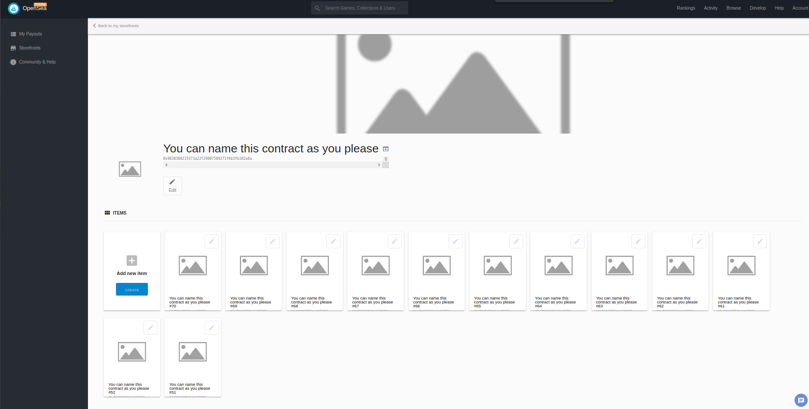
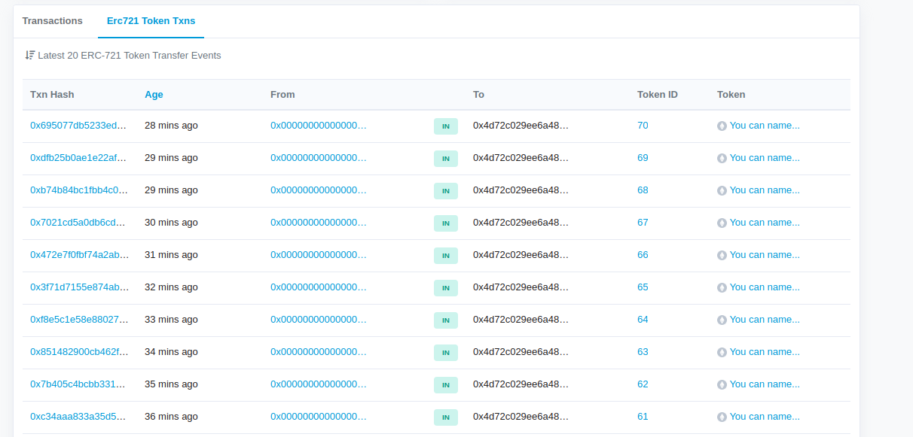
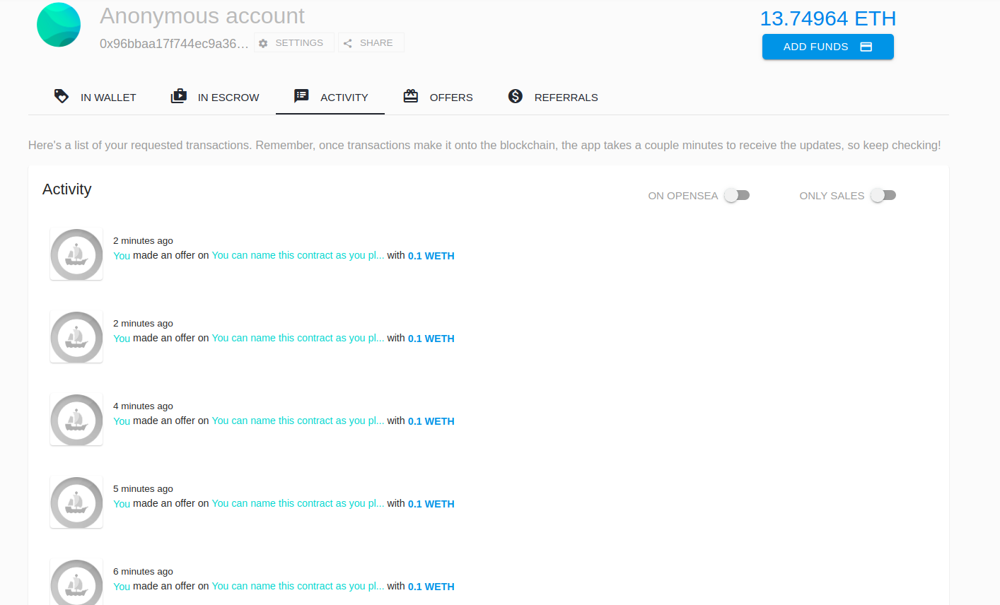

# Udacity Blockchain Capstone

The capstone will build upon the knowledge you have gained in the course in order to build a decentralized housing product. 

# Zokrates

```
project_Capstone$ docker run -v /home/hajime/git/BlockchainDevND/projects/project_Capstone:/home/zokrates/code -it zokrates/zokrates /bin/bash


    1  cd code
    2  cd zokrates/
    3  cd code/
    4  cd square/
    5  ~/zokrates compile -i square.code 
    6  ~/zokrates setup
    7  ~/zokrates generate-proof
    8  ~/zokrates compute-witness -a 3 9
    9  ~/zokrates generate-proof
   10  ~/zokrates export-verifier
```

# Test

Student includes a README to explain how to test thier code.

## steps

In 1st console, run
`
> truffle develop
`

In the 2nd console

`
> truffel develop
> test
`


## Result

truffle(develop)> test
Using network 'develop'.

```
Compiling your contracts...
===========================
> Everything is up to date, there is nothing to compile.


  Contract: TestERC721Mintable
    match erc721 spec
      ✓ should return total supply
      ✓ should get token balance
      ✓ should return token uri
      ✓ should transfer token from one owner to another (63ms)
    have ownership properties
      ✓ should fail when minting when address is not contract owner
      ✓ should return contract owner

  Contract: TestSolnSquareVerifier
    match erc721 spec
      ✓ Test if a new solution can be added for contract - SolnSquareVerifier
Result {
  '0': '0x0000000000000000000000000000000000000000',
  '1': '0x1598CF27b2D63e17Fa30cE9cdAc39835A600f3aa',
  '2': <BN: a>,
  __length__: 3,
  from: '0x0000000000000000000000000000000000000000',
  to: '0x1598CF27b2D63e17Fa30cE9cdAc39835A600f3aa',
  tokenId: <BN: a> }
ReferenceError: address is not defined
    at contract.mintToken.then (/home/hajime/git/BlockchainDevND/projects/project_Capstone/eth-contracts/test/TestSolnSquareVerifier.js:57:57)
    at process._tickCallback (internal/process/next_tick.js:68:7)
      ✓ Test if an ERC721 token can be minted for contract - SolnSquareVerifier (570ms)

  Contract: Verifier 
    Test for verifyTx
      ✓ Test verification with correct proof (545ms)
      ✓ Test verification with incorrect proof (543ms)
```

  10 passing (5s)


# Deploy to Rinkeby Test Network

```
$ truffle migrate --reset --network Rinkebyproject_Capstone/eth
Compiling your contracts...
===========================
> Everything is up to date, there is nothing to compile.


Starting migrations...
======================
> Network name:    'Rinkeby'
> Network id:      4
> Block gas limit: 0x6acfc0


1_initial_migration.js
======================

   Replacing 'Migrations'
   ----------------------
   > transaction hash:    0xc721f72491ffd9d5635ed58b69d2ed024ed8bb99b4aee9e27049319d9c668200
   > Blocks: 0            Seconds: 9
   > contract address:    0x3B24B9B6D02bC18c30A28af932BE1B0569A98C47
   > block number:        5339762
   > block timestamp:     1572235552
   > account:             0x793d902BF4bE16bBFf900B9CE89A88c1cA1ccA9a
   > balance:             37.10419367
   > gas used:            261393
   > gas price:           20 gwei
   > value sent:          0 ETH
   > total cost:          0.00522786 ETH

   Pausing for 2 confirmations...
   ------------------------------
   > confirmation number: 1 (block: 5339763)
(base) hajime@hajime-DAIV-NG5800:~/git/BlockchainDevND/projects/project_Capstone/eth-contracts$ truffle migrate --reset --network Rinkeby

Compiling your contracts...
===========================
> Everything is up to date, there is nothing to compile.


Starting migrations...
======================
> Network name:    'Rinkeby'
> Network id:      4
> Block gas limit: 0x6ad631


1_initial_migration.js
======================

   Replacing 'Migrations'
   ----------------------
   > transaction hash:    0xf972cceb3a95d99a807f0f28e9943bb0f907e784eb68a9571618d14ef815237f
   > Blocks: 0            Seconds: 13
   > contract address:    0xb4a3C5633f0381DF5eC1853EDdA61Be3e1B1a55f
   > block number:        5339825
   > block timestamp:     1572236497
   > account:             0x4d72C029ee6A481121172978c0265b04b9EAaAfF
   > balance:             18.74477214
   > gas used:            261393
   > gas price:           20 gwei
   > value sent:          0 ETH
   > total cost:          0.00522786 ETH

   Pausing for 2 confirmations...
   ------------------------------
   > confirmation number: 1 (block: 5339826)
   > confirmation number: 2 (block: 5339827)

   > Saving migration to chain.
   > Saving artifacts
   -------------------------------------
   > Total cost:          0.00522786 ETH


2_deploy_contracts.js
=====================

   Replacing 'Verifier'
   --------------------
   > transaction hash:    0x0906d89e031b8707898e4ab6e6f281a325999574ba71f784754af47f516fea85
   > Blocks: 0            Seconds: 9
   > contract address:    0x61Fa60992f2643C39194E0f8877B94F28188dE91
   > block number:        5339829
   > block timestamp:     1572236557
   > account:             0x4d72C029ee6A481121172978c0265b04b9EAaAfF
   > balance:             18.71966802
   > gas used:            1213183
   > gas price:           20 gwei
   > value sent:          0 ETH
   > total cost:          0.02426366 ETH

   Pausing for 2 confirmations...
   ------------------------------
   > confirmation number: 1 (block: 5339830)
   > confirmation number: 2 (block: 5339831)

   Replacing 'SolnSquareVerifier'
   ------------------------------
   > transaction hash:    0xb7103739da2342ab728a059c0417a95f0f3d177083f5e88ecdb89c7ab01b5e87
   > Blocks: 0            Seconds: 9
   > contract address:    0x9638360215373a22f29087509271F6b3Fb102A8a
   > block number:        5339832
   > block timestamp:     1572236602
   > account:             0x4d72C029ee6A481121172978c0265b04b9EAaAfF
   > balance:             18.64214642
   > gas used:            3876080
   > gas price:           20 gwei
   > value sent:          0 ETH
   > total cost:          0.0775216 ETH

   Pausing for 2 confirmations...
   ------------------------------
   > confirmation number: 1 (block: 5339833)
   > confirmation number: 2 (block: 5339834)

   > Saving migration to chain.
   > Saving artifacts
   -------------------------------------
   > Total cost:          0.10178526 ETH


Summary
=======
> Total deployments:   3
> Final cost:          0.10701312 ETH

```

## Contract Address

0x9638360215373a22f29087509271F6b3Fb102A8a

## Contract ABI

```
[
    {
      "constant": true,
      "inputs": [
        {
          "name": "interfaceId",
          "type": "bytes4"
        }
      ],
      "name": "supportsInterface",
      "outputs": [
        {
          "name": "",
          "type": "bool"
        }
      ],
      "payable": false,
      "stateMutability": "view",
      "type": "function"
    },
    {
      "constant": false,
      "inputs": [
        {
          "name": "status",
          "type": "bool"
        }
      ],
      "name": "pause",
      "outputs": [],
      "payable": false,
      "stateMutability": "nonpayable",
      "type": "function"
    },
    {
      "constant": true,
      "inputs": [],
      "name": "name",
      "outputs": [
        {
          "name": "",
          "type": "string"
        }
      ],
      "payable": false,
      "stateMutability": "view",
      "type": "function"
    },
    {
      "constant": true,
      "inputs": [
        {
          "name": "tokenId",
          "type": "uint256"
        }
      ],
      "name": "getApproved",
      "outputs": [
        {
          "name": "",
          "type": "address"
        }
      ],
      "payable": false,
      "stateMutability": "view",
      "type": "function"
    },
    {
      "constant": false,
      "inputs": [
        {
          "name": "to",
          "type": "address"
        },
        {
          "name": "tokenId",
          "type": "uint256"
        }
      ],
      "name": "approve",
      "outputs": [],
      "payable": false,
      "stateMutability": "nonpayable",
      "type": "function"
    },
    {
      "constant": true,
      "inputs": [],
      "name": "totalSupply",
      "outputs": [
        {
          "name": "",
          "type": "uint256"
        }
      ],
      "payable": false,
      "stateMutability": "view",
      "type": "function"
    },
    {
      "constant": false,
      "inputs": [
        {
          "name": "from",
          "type": "address"
        },
        {
          "name": "to",
          "type": "address"
        },
        {
          "name": "tokenId",
          "type": "uint256"
        }
      ],
      "name": "transferFrom",
      "outputs": [],
      "payable": false,
      "stateMutability": "nonpayable",
      "type": "function"
    },
    {
      "constant": false,
      "inputs": [
        {
          "name": "_myid",
          "type": "bytes32"
        },
        {
          "name": "_result",
          "type": "string"
        }
      ],
      "name": "__callback",
      "outputs": [],
      "payable": false,
      "stateMutability": "nonpayable",
      "type": "function"
    },
    {
      "constant": true,
      "inputs": [
        {
          "name": "owner",
          "type": "address"
        },
        {
          "name": "index",
          "type": "uint256"
        }
      ],
      "name": "tokenOfOwnerByIndex",
      "outputs": [
        {
          "name": "",
          "type": "uint256"
        }
      ],
      "payable": false,
      "stateMutability": "view",
      "type": "function"
    },
    {
      "constant": false,
      "inputs": [
        {
          "name": "_myid",
          "type": "bytes32"
        },
        {
          "name": "_result",
          "type": "string"
        },
        {
          "name": "_proof",
          "type": "bytes"
        }
      ],
      "name": "__callback",
      "outputs": [],
      "payable": false,
      "stateMutability": "nonpayable",
      "type": "function"
    },
    {
      "constant": false,
      "inputs": [
        {
          "name": "to",
          "type": "address"
        },
        {
          "name": "tokenId",
          "type": "uint256"
        }
      ],
      "name": "mint",
      "outputs": [
        {
          "name": "",
          "type": "bool"
        }
      ],
      "payable": false,
      "stateMutability": "nonpayable",
      "type": "function"
    },
    {
      "constant": false,
      "inputs": [
        {
          "name": "from",
          "type": "address"
        },
        {
          "name": "to",
          "type": "address"
        },
        {
          "name": "tokenId",
          "type": "uint256"
        }
      ],
      "name": "safeTransferFrom",
      "outputs": [],
      "payable": false,
      "stateMutability": "nonpayable",
      "type": "function"
    },
    {
      "constant": true,
      "inputs": [
        {
          "name": "index",
          "type": "uint256"
        }
      ],
      "name": "tokenByIndex",
      "outputs": [
        {
          "name": "",
          "type": "uint256"
        }
      ],
      "payable": false,
      "stateMutability": "view",
      "type": "function"
    },
    {
      "constant": true,
      "inputs": [
        {
          "name": "tokenId",
          "type": "uint256"
        }
      ],
      "name": "ownerOf",
      "outputs": [
        {
          "name": "",
          "type": "address"
        }
      ],
      "payable": false,
      "stateMutability": "view",
      "type": "function"
    },
    {
      "constant": true,
      "inputs": [
        {
          "name": "owner",
          "type": "address"
        }
      ],
      "name": "balanceOf",
      "outputs": [
        {
          "name": "",
          "type": "uint256"
        }
      ],
      "payable": false,
      "stateMutability": "view",
      "type": "function"
    },
    {
      "constant": true,
      "inputs": [],
      "name": "owner",
      "outputs": [
        {
          "name": "",
          "type": "address"
        }
      ],
      "payable": false,
      "stateMutability": "view",
      "type": "function"
    },
    {
      "constant": false,
      "inputs": [
        {
          "name": "to",
          "type": "address"
        },
        {
          "name": "approved",
          "type": "bool"
        }
      ],
      "name": "setApprovalForAll",
      "outputs": [],
      "payable": false,
      "stateMutability": "nonpayable",
      "type": "function"
    },
    {
      "constant": true,
      "inputs": [
        {
          "name": "",
          "type": "bytes32"
        }
      ],
      "name": "mapSolution",
      "outputs": [
        {
          "name": "index",
          "type": "uint256"
        },
        {
          "name": "account",
          "type": "address"
        }
      ],
      "payable": false,
      "stateMutability": "view",
      "type": "function"
    },
    {
      "constant": false,
      "inputs": [
        {
          "name": "from",
          "type": "address"
        },
        {
          "name": "to",
          "type": "address"
        },
        {
          "name": "tokenId",
          "type": "uint256"
        },
        {
          "name": "_data",
          "type": "bytes"
        }
      ],
      "name": "safeTransferFrom",
      "outputs": [],
      "payable": false,
      "stateMutability": "nonpayable",
      "type": "function"
    },
    {
      "constant": true,
      "inputs": [
        {
          "name": "tokenId",
          "type": "uint256"
        }
      ],
      "name": "tokenURI",
      "outputs": [
        {
          "name": "",
          "type": "string"
        }
      ],
      "payable": false,
      "stateMutability": "view",
      "type": "function"
    },
    {
      "constant": true,
      "inputs": [
        {
          "name": "owner",
          "type": "address"
        },
        {
          "name": "operator",
          "type": "address"
        }
      ],
      "name": "isApprovedForAll",
      "outputs": [
        {
          "name": "",
          "type": "bool"
        }
      ],
      "payable": false,
      "stateMutability": "view",
      "type": "function"
    },
    {
      "constant": false,
      "inputs": [
        {
          "name": "newOwner",
          "type": "address"
        }
      ],
      "name": "transferOwnership",
      "outputs": [],
      "payable": false,
      "stateMutability": "nonpayable",
      "type": "function"
    },
    {
      "inputs": [
        {
          "name": "verifierAddress",
          "type": "address"
        },
        {
          "name": "name",
          "type": "string"
        },
        {
          "name": "symbol",
          "type": "string"
        }
      ],
      "payable": false,
      "stateMutability": "nonpayable",
      "type": "constructor"
    },
    {
      "anonymous": false,
      "inputs": [
        {
          "indexed": false,
          "name": "_index",
          "type": "uint256"
        },
        {
          "indexed": false,
          "name": "account",
          "type": "address"
        }
      ],
      "name": "evSolutionAdded",
      "type": "event"
    },
    {
      "anonymous": false,
      "inputs": [
        {
          "indexed": true,
          "name": "from",
          "type": "address"
        },
        {
          "indexed": true,
          "name": "to",
          "type": "address"
        },
        {
          "indexed": true,
          "name": "tokenId",
          "type": "uint256"
        }
      ],
      "name": "Transfer",
      "type": "event"
    },
    {
      "anonymous": false,
      "inputs": [
        {
          "indexed": true,
          "name": "owner",
          "type": "address"
        },
        {
          "indexed": true,
          "name": "approved",
          "type": "address"
        },
        {
          "indexed": true,
          "name": "tokenId",
          "type": "uint256"
        }
      ],
      "name": "Approval",
      "type": "event"
    },
    {
      "anonymous": false,
      "inputs": [
        {
          "indexed": true,
          "name": "owner",
          "type": "address"
        },
        {
          "indexed": true,
          "name": "operator",
          "type": "address"
        },
        {
          "indexed": false,
          "name": "approved",
          "type": "bool"
        }
      ],
      "name": "ApprovalForAll",
      "type": "event"
    },
    {
      "anonymous": false,
      "inputs": [],
      "name": "Paused",
      "type": "event"
    },
    {
      "anonymous": false,
      "inputs": [],
      "name": "Unpaused",
      "type": "event"
    },
    {
      "anonymous": false,
      "inputs": [
        {
          "indexed": false,
          "name": "fromOwner",
          "type": "address"
        },
        {
          "indexed": false,
          "name": "toOwner",
          "type": "address"
        }
      ],
      "name": "evOwnershipTransfered",
      "type": "event"
    },
    {
      "constant": false,
      "inputs": [
        {
          "name": "_key",
          "type": "bytes32"
        },
        {
          "name": "_index",
          "type": "uint256"
        },
        {
          "name": "_account",
          "type": "address"
        }
      ],
      "name": "addSolution",
      "outputs": [],
      "payable": false,
      "stateMutability": "nonpayable",
      "type": "function"
    },
    {
      "constant": false,
      "inputs": [
        {
          "name": "_index",
          "type": "uint256"
        },
        {
          "name": "_account",
          "type": "address"
        },
        {
          "name": "a",
          "type": "uint256[2]"
        },
        {
          "name": "b",
          "type": "uint256[2][2]"
        },
        {
          "name": "c",
          "type": "uint256[2]"
        },
        {
          "name": "input",
          "type": "uint256[2]"
        }
      ],
      "name": "mintToken",
      "outputs": [],
      "payable": false,
      "stateMutability": "nonpayable",
      "type": "function"
    }
  ]
```

## OpenSea MarketPlace Storefront

https://rinkeby.opensea.io/storefront/you-can-name-this-contract-as-you-please



# Token URI

https://s3-us-west-2.amazonaws.com/udacity-blockchain/capstone/70
https://s3-us-west-2.amazonaws.com/udacity-blockchain/capstone/69
https://s3-us-west-2.amazonaws.com/udacity-blockchain/capstone/68
https://s3-us-west-2.amazonaws.com/udacity-blockchain/capstone/67
https://s3-us-west-2.amazonaws.com/udacity-blockchain/capstone/66
https://s3-us-west-2.amazonaws.com/udacity-blockchain/capstone/65
https://s3-us-west-2.amazonaws.com/udacity-blockchain/capstone/64
https://s3-us-west-2.amazonaws.com/udacity-blockchain/capstone/63
https://s3-us-west-2.amazonaws.com/udacity-blockchain/capstone/62
https://s3-us-west-2.amazonaws.com/udacity-blockchain/capstone/61

# Opensea Storefront Address

https://rinkeby.opensea.io/assets/you-can-name-this-contract-as-you-please

Maybe only my access.
https://rinkeby.opensea.io/assets/0x9638360215373a22f29087509271f6b3fb102a8a/70?
https://rinkeby.opensea.io/assets/0x9638360215373a22f29087509271f6b3fb102a8a/69?
https://rinkeby.opensea.io/assets/0x9638360215373a22f29087509271f6b3fb102a8a/68?
https://rinkeby.opensea.io/assets/0x9638360215373a22f29087509271f6b3fb102a8a/67?
https://rinkeby.opensea.io/assets/0x9638360215373a22f29087509271f6b3fb102a8a/66?
https://rinkeby.opensea.io/assets/0x9638360215373a22f29087509271f6b3fb102a8a/65?
https://rinkeby.opensea.io/assets/0x9638360215373a22f29087509271f6b3fb102a8a/64?
https://rinkeby.opensea.io/assets/0x9638360215373a22f29087509271f6b3fb102a8a/63?
https://rinkeby.opensea.io/assets/0x9638360215373a22f29087509271f6b3fb102a8a/62?
https://rinkeby.opensea.io/assets/0x9638360215373a22f29087509271f6b3fb102a8a/61?


### Seller



### Buyer



# Project Resources

* [Remix - Solidity IDE](https://remix.ethereum.org/)
* [Visual Studio Code](https://code.visualstudio.com/)
* [Truffle Framework](https://truffleframework.com/)
* [Ganache - One Click Blockchain](https://truffleframework.com/ganache)
* [Open Zeppelin ](https://openzeppelin.org/)
* [Interactive zero knowledge 3-colorability demonstration](http://web.mit.edu/~ezyang/Public/graph/svg.html)
* [Docker](https://docs.docker.com/install/)
* [ZoKrates](https://github.com/Zokrates/ZoKrates)
