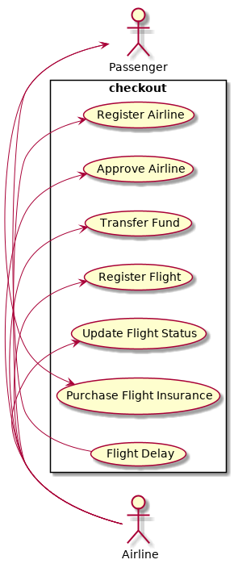
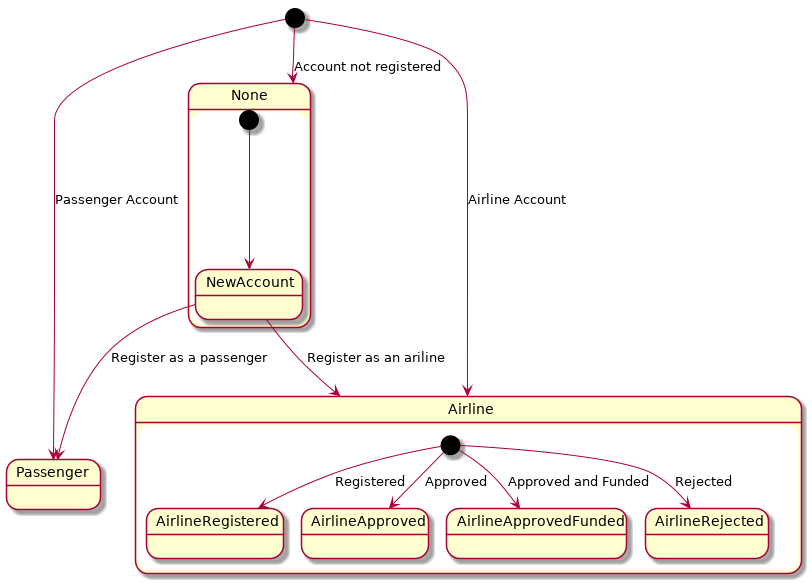
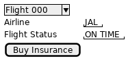
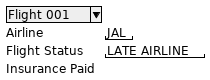
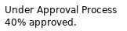
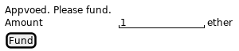
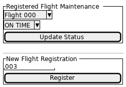
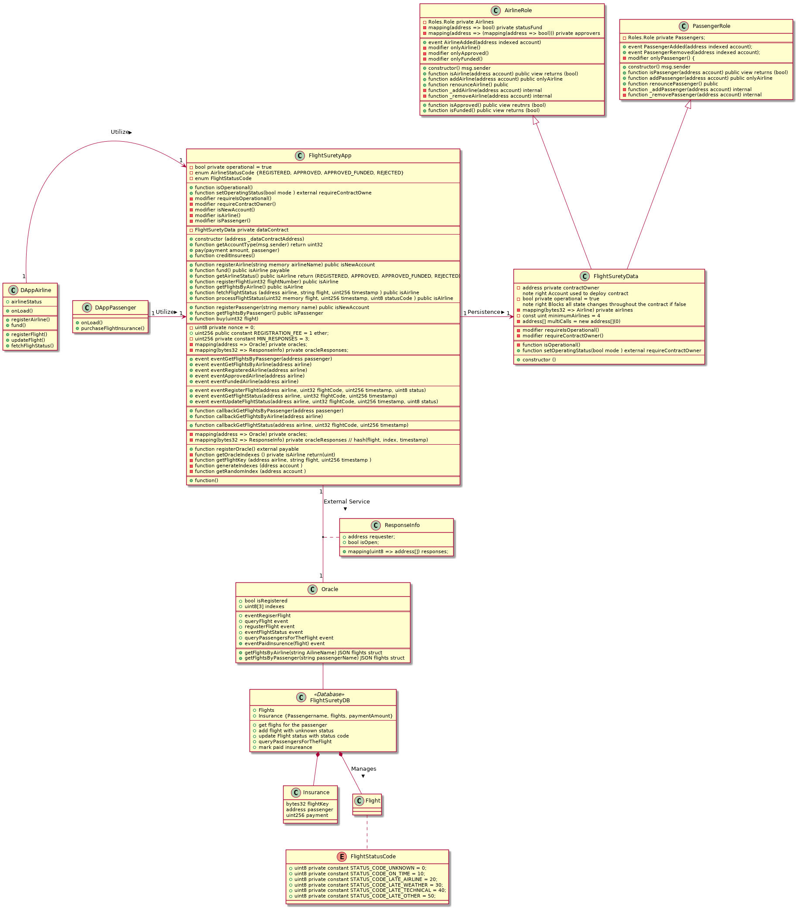
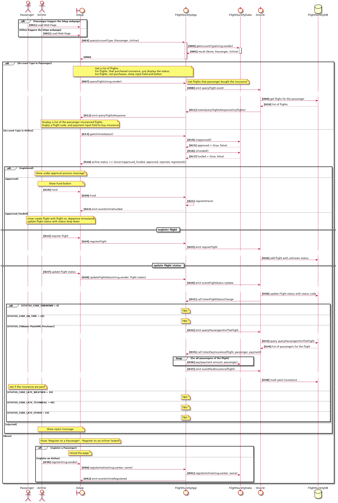

# Flight Surety Report

## Setup and Run

## Software Versions

$ truffle version
Truffle v5.0.40 (core: 5.0.40)
Solidity v0.5.8 (solc-js)
Node v10.16.2
Web3.js v1.2.1

### Install

This repository contains Smart Contract code in Solidity (using Truffle), tests (also using Truffle), dApp scaffolding (using HTML, CSS and JS) and server app scaffolding.

To install, download or clone the repo, then:

`npm install`
`truffle compile`

## Run trufle develop chain

Run the following to launch the truffle develop chain

`truffle develop'

This will set up 20 accounts on the chain.
In the truffle console,

`migrate --reset`

This will compile and migrate your smart contracts to your develop chain.

`truffle migrate`

### Run tests

Run the following to launch the truffle develop chain

`truffle develop'

Then in the truflle console, run

`test`

### Develop Client

To use the dapp: using drizzle framework for this project.

`cd src/dapp`
`npm install`
`npm start`

This will automatically launch your default browser.
Otherwise, to view dapp:

`http://localhost:8000`

You need your metamask to connect to your local truffle develop chain.
You need to wait 30 seconds in this development mock.

You may need to run the following in Linux

`echo fs.inotify.max_user_watches=524288 | sudo tee -a /etc/sysctl.conf`


### Develop Server

`npm run server`
`truffle test ./test/oracles.js`

### Resources

* [How does Ethereum work anyway?](https://medium.com/@preethikasireddy/how-does-ethereum-work-anyway-22d1df506369)
* [BIP39 Mnemonic Generator](https://iancoleman.io/bip39/)
* [Truffle Framework](http://truffleframework.com/)
* [Ganache Local Blockchain](http://truffleframework.com/ganache/)
* [Remix Solidity IDE](https://remix.ethereum.org/)
* [Solidity Language Reference](http://solidity.readthedocs.io/en/v0.4.24/)
* [Ethereum Blockchain Explorer](https://etherscan.io/)
* [Web3Js Reference](https://github.com/ethereum/wiki/wiki/JavaScript-API)

## Use Cases


## User Flow (DApp)


### The account is not registered


### Passenger account
#### Passenger


#### Passenger


#### Flight Delayed 


### Airline account

#### Registered


#### Approved


#### Approved and Funded


#### Rejected
NA

## Class Diagram


## Operation Design

### Sequence


## Surya output


### Contracts Description Table


|  Contract  |         Type        |       Bases      |                  |                 |
|:----------:|:-------------------:|:----------------:|:----------------:|:---------------:|
|     └      |  **Function Name**  |  **Visibility**  |  **Mutability**  |  **Modifiers**  |
||||||
| **FlightSuretyApp** | Implementation |  |||
| └ | _isAirline | Private 🔐 |   | |
| └ | _isFundedAirline | Private 🔐 |   | |
| └ | _isPassenger | Private 🔐 |   | |
| └ | getAccountType | External ❗️ | 🛑  | requireIsOperational |
| └ | \<Constructor\> | Public ❗️ | 🛑  | |
| └ | isOperational | Public ❗️ |   |NO❗️ |
| └ | setOperatingStatus | External ❗️ | 🛑  | requireContractOwner |
| └ | registerAirline | External ❗️ | 🛑  | onlyNewAccount |
| └ | approveAirline | External ❗️ | 🛑  | onlyAirline |
| └ | fund | External ❗️ |  💵 | requireIsOperational onlyAirline enoughFundAmount |
| └ | getAirlineStatus | External ❗️ | 🛑  | requireIsOperational onlyAirline |
| └ | registerFlight | External ❗️ | 🛑  | requireIsOperational onlyAirline onlyFundedAirline |
| └ | updateFlightStatus | External ❗️ | 🛑  | requireIsOperational onlyAirline onlyFlightProvider |
| └ | listenFlightStatuUpdatesUpdate | External ❗️ | 🛑  | requireIsOperational |
| └ | fetchFlightStatus | External ❗️ | 🛑  |NO❗️ |
| └ | registerPassenger | External ❗️ | 🛑  | onlyNewAccount |
| └ | buy | External ❗️ |  💵 | requireIsOperational onlyPassenger |
| └ | withdraw | External ❗️ | 🛑  | requireIsOperational onlyPassenger |
| └ | registerOracle | External ❗️ |  💵 |NO❗️ |
| └ | getRegistrationFee | Public ❗️ |   |NO❗️ |
| └ | getMyIndexes | External ❗️ |   |NO❗️ |
| └ | submitOracleResponse | External ❗️ | 🛑  | requireIsOperational |
| └ | getFlightKey | Internal 🔒 |   | |
| └ | generateIndexes | Internal 🔒 | 🛑  | |
| └ | getRandomIndex | Internal 🔒 | 🛑  | |
||||||
| **SafeMath** | Library |  |||
| └ | add | Internal 🔒 |   | |
| └ | sub | Internal 🔒 |   | |
| └ | mul | Internal 🔒 |   | |
| └ | div | Internal 🔒 |   | |
| └ | mod | Internal 🔒 |   | |
||||||
| **FlightSuretyData** | Implementation | AirlineData, PassengerData |||
| └ | \<Constructor\> | Public ❗️ | 🛑  | |
| └ | insurance | External ❗️ | 🛑  | requireIsOperational |
| └ | addPayment | External ❗️ | 🛑  | requireIsOperational |
| └ | isOperational | Public ❗️ |   |NO❗️ |
| └ | setOperational | External ❗️ | 🛑  | requireContractOwner |
| └ | getFlightKey | Internal 🔒 |   | |
| └ | \<Fallback\> | External ❗️ |  💵 |NO❗️ |
||||||
| **AirlineData** | Implementation |  |||
| └ | isApproved | Public ❗️ |   |NO❗️ |
| └ | isFunded | Public ❗️ |   |NO❗️ |
| └ | isAirline | Public ❗️ |   |NO❗️ |
| └ | addAirline | External ❗️ | 🛑  |NO❗️ |
| └ | renounceAirline | External ❗️ | 🛑  |NO❗️ |
| └ | _addAirline | Internal 🔒 | 🛑  | |
| └ | _removeAirline | Private 🔐 | 🛑  | |
| └ | getAirline | External ❗️ |   |NO❗️ |
| └ | _lessThanMinimum | Private 🔐 |   | |
| └ | _approvable | Private 🔐 |   | |
| └ | approveAirline | External ❗️ | 🛑  | onlyAirline onlyAirline onlyFunded firstApproved |
| └ | funded | External ❗️ | 🛑  | onlyAirline notYetFunded |
||||||
| **PassengerData** | Implementation |  |||
| └ | isPassenger | Public ❗️ |   |NO❗️ |
| └ | addPassenger | External ❗️ | 🛑  |NO❗️ |
| └ | renouncePassenger | Public ❗️ | 🛑  |NO❗️ |
| └ | _addPassenger | Private 🔐 | 🛑  | |
| └ | _removePassenger | Private 🔐 | 🛑  | |
| └ | getPassenger | Public ❗️ |   |NO❗️ |
| └ | pay | Internal 🔒 | 🛑  | onlyPassenger |
| └ | withdraw | External ❗️ | 🛑  | onlyPassenger |


### Legend

|  Symbol  |  Meaning  |
|:--------:|-----------|
|    🛑    | Function can modify state |
|    💵    | Function is payable |


## truffle test outputs

```
 Contract: Flight Surety Tests
    ✓ (operation) has correct initial isOperational() value
    ✓ (operation) setOperatingStatus() to false
    ✓ (operation) setOperatingStatus() to true
    ✓ (operation) can block access to functions using requireIsOperational when operating status is false
    ✓ (airline) default registerAirline for initial airplane, and see if it is in approved status (134ms)
    ✓ (airline) Until minimum 4 airlines need to be registered, airline status is approved (558ms)
    ✓ (flight) register flight to emit event (48ms)
    ✓ (flight) update flight to emit event
    ✓ (passenger) is Passenger (81ms)

  Contract: Oracles
Oracle Registered: 9, 4, 0
Oracle Registered: 3, 5, 9
Oracle Registered: 4, 9, 5
Oracle Registered: 8, 9, 0
Oracle Registered: 8, 7, 3
Oracle Registered: 3, 0, 5
Oracle Registered: 8, 0, 2
Oracle Registered: 3, 6, 9
Oracle Registered: 5, 3, 9
Oracle Registered: 1, 9, 2
Oracle Registered: 6, 3, 8
Oracle Registered: 5, 6, 4
Oracle Registered: 3, 5, 7
Oracle Registered: 5, 3, 4
Oracle Registered: 6, 8, 3
Oracle Registered: 5, 7, 0
Oracle Registered: 2, 5, 0
Oracle Registered: 3, 2, 1
Oracle Registered: 2, 1, 9
    ✓ can register oracles (1285ms)
0

Error 0 9 ND1309 1571808628
1

Error 1 4 ND1309 1571808628
2

Error 2 0 ND1309 1571808628
0

Error 0 3 ND1309 1571808628
1

Error 1 5 ND1309 1571808628
2

Error 2 9 ND1309 1571808628
0

Error 0 4 ND1309 1571808628
1

Error 1 9 ND1309 1571808628
2

Error 2 5 ND1309 1571808628
0

Error 0 8 ND1309 1571808628
1

Error 1 9 ND1309 1571808628
2

Error 2 0 ND1309 1571808628
0

Error 0 8 ND1309 1571808628
1
2

Error 2 3 ND1309 1571808628
0

Error 0 3 ND1309 1571808628
1

Error 1 0 ND1309 1571808628
2

Error 2 5 ND1309 1571808628
0

Error 0 8 ND1309 1571808628
1

Error 1 0 ND1309 1571808628
2

Error 2 2 ND1309 1571808628
0

Error 0 3 ND1309 1571808628
1

Error 1 6 ND1309 1571808628
2

Error 2 9 ND1309 1571808628
0

Error 0 5 ND1309 1571808628
1

Error 1 3 ND1309 1571808628
2

Error 2 9 ND1309 1571808628
0

Error 0 1 ND1309 1571808628
1

Error 1 9 ND1309 1571808628
2

Error 2 2 ND1309 1571808628
0

Error 0 6 ND1309 1571808628
1

Error 1 3 ND1309 1571808628
2

Error 2 8 ND1309 1571808628
0

Error 0 5 ND1309 1571808628
1

Error 1 6 ND1309 1571808628
2

Error 2 4 ND1309 1571808628
0

Error 0 3 ND1309 1571808628
1

Error 1 5 ND1309 1571808628
2
0

Error 0 5 ND1309 1571808628
1

Error 1 3 ND1309 1571808628
2

Error 2 4 ND1309 1571808628
0

Error 0 6 ND1309 1571808628
1

Error 1 8 ND1309 1571808628
2

Error 2 3 ND1309 1571808628
0

Error 0 5 ND1309 1571808628
1
2

Error 2 0 ND1309 1571808628
0

Error 0 2 ND1309 1571808628
1

Error 1 5 ND1309 1571808628
2

Error 2 0 ND1309 1571808628
0

Error 0 3 ND1309 1571808628
1

Error 1 2 ND1309 1571808628
2

Error 2 1 ND1309 1571808628
0

Error 0 2 ND1309 1571808628
1

Error 1 1 ND1309 1571808628
2

Error 2 9 ND1309 1571808628
    ✓ can request flight status (1745ms)


  11 passing (4s)
```