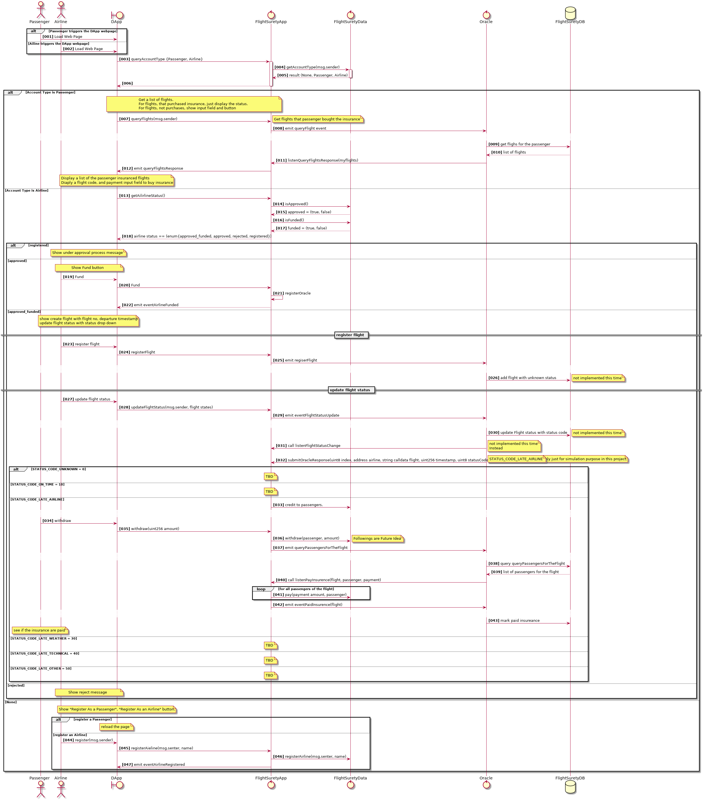

# Flight Surety Report

## Setup and Run

## Software Versions

$ truffle version
Truffle v5.0.31 (core: 5.0.31)
Solidity v0.5.0 (solc-js)
Node v10.16.2
Web3.js v1.2.1

### Install

This repository contains Smart Contract code in Solidity (using Truffle), tests (also using Truffle), dApp scaffolding (using HTML, CSS and JS) and server app scaffolding.

To install, download or clone the repo, then:

`npm install`
`truffle compile`

### Develop Client

To run truffle tests:

`truffle test ./test/flightSurety.js`
`truffle test ./test/oracles.js`

To use the dapp:

`truffle migrate`
`npm run dapp`

To view dapp:

`http://localhost:8000`

### Develop Server

`npm run server`
`truffle test ./test/oracles.js`

### Deploy

To build dapp for prod:
`npm run dapp:prod`

Deploy the contents of the ./dapp folder

### Resources

* [How does Ethereum work anyway?](https://medium.com/@preethikasireddy/how-does-ethereum-work-anyway-22d1df506369)
* [BIP39 Mnemonic Generator](https://iancoleman.io/bip39/)
* [Truffle Framework](http://truffleframework.com/)
* [Ganache Local Blockchain](http://truffleframework.com/ganache/)
* [Remix Solidity IDE](https://remix.ethereum.org/)
* [Solidity Language Reference](http://solidity.readthedocs.io/en/v0.4.24/)
* [Ethereum Blockchain Explorer](https://etherscan.io/)
* [Web3Js Reference](https://github.com/ethereum/wiki/wiki/JavaScript-API)

## Use Cases

## User Flow (DApp)

### The account is not registered

### Passenger account
#### Passenger

#### Passenger

#### Flight Delayed 

### Airline account

#### Registered

#### Approved

#### Approved and Funded

#### Rejected
NA

## Class Diagram

## Operation Design

### Sequence

## Surya output

## Sūrya's Description Report

### Files Description Table

|  File Name  |  SHA-1 Hash  |
|-------------|--------------|
| AirlineData.sol | acbe6e05fc304a61c3057e01b9aade206a95d8b9 |
| FlightSuretyApp.sol | fce62880885a7251d199e7891728a9925b0c9059 |
| FlightSuretyData.sol | 70d366f35e5336e553dd5334452ffdd15b710e2c |
| Migrations.sol | ff36914465225aebc1910f2f514161561f4adec1 |
| PassengerData.sol | db8963b49b9a9f50ed9fb7a4ce1cc7f214ae18fd |

### Contracts Description Table

|  Contract  |         Type        |       Bases      |                  |                 |
|:----------:|:-------------------:|:----------------:|:----------------:|:---------------:|
|     └      |  **Function Name**  |  **Visibility**  |  **Mutability**  |  **Modifiers**  |
||||||
| **AirlineData** | Implementation |  |||
| └ | isApproved | Public ❗️ |   |NO❗️ |
| └ | isFunded | Public ❗️ |   |NO❗️ |
| └ | isAirline | Public ❗️ |   |NO❗️ |
| └ | addAirline | External ❗️ | 🛑  |NO❗️ |
| └ | renounceAirline | External ❗️ | 🛑  |NO❗️ |
| └ | _addAirline | Internal 🔒 | 🛑  | |
| └ | _removeAirline | Private 🔐 | 🛑  | |
| └ | getAirline | External ❗️ |   |NO❗️ |
| └ | _lessThanMinimum | Private 🔐 |   | |
| └ | _approvable | Private 🔐 |   | |
| └ | approveAirline | External ❗️ | 🛑  | onlyAirline onlyAirline onlyFunded firstApproved |
| └ | funded | External ❗️ | 🛑  | onlyAirline notYetFunded |
||||||
| **FlightSuretyApp** | Implementation |  |||
| └ | _isAirline | Private 🔐 |   | |
| └ | _isPassenger | Private 🔐 |   | |
| └ | getAccountType | Public ❗️ |   |NO❗️ |
| └ | \<Constructor\> | Public ❗️ | 🛑  | |
| └ | datacontract | Public ❗️ | 🛑  |NO❗️ |
| └ | isOperational | Public ❗️ |   |NO❗️ |
| └ | setOperatingStatus | External ❗️ | 🛑  | requireContractOwner |
| └ | registerAirline | External ❗️ | 🛑  | onlyNewAccount |
| └ | approveAirline | External ❗️ | 🛑  | onlyAirline |
| └ | fund | External ❗️ |  💵 | requireIsOperational onlyAirline enoughFundAmount |
| └ | getAirlineStatus | External ❗️ |   | requireIsOperational onlyAirline |
| └ | registerFlight | External ❗️ | 🛑  | requireIsOperational onlyAirline |
| └ | updateFlightStatus | External ❗️ | 🛑  | requireIsOperational onlyAirline onlyFlightProvider |
| └ | listenFlightStatuUpdatesUpdate | External ❗️ | 🛑  | requireIsOperational |
| └ | registerPassenger | External ❗️ | 🛑  | onlyNewAccount |
| └ | buy | External ❗️ |  💵 | requireIsOperational onlyPassenger |
| └ | withdraw | External ❗️ | 🛑  | requireIsOperational onlyPassenger |
| └ | registerOracle | External ❗️ |  💵 |NO❗️ |
| └ | getRegistrationFee | Public ❗️ |   |NO❗️ |
| └ | getMyIndexes | External ❗️ |   |NO❗️ |
| └ | submitOracleResponse | External ❗️ | 🛑  | requireIsOperational |
| └ | getFlightKey | Internal 🔒 |   | |
| └ | generateIndexes | Internal 🔒 | 🛑  | |
| └ | getRandomIndex | Internal 🔒 | 🛑  | |
||||||
| **FlightSuretyData** | Implementation | AirlineData, PassengerData |||
| └ | \<Constructor\> | Public ❗️ | 🛑  | |
| └ | insurance | External ❗️ | 🛑  | requireIsOperational requireContractOwner |
| └ | addPayment | External ❗️ | 🛑  | requireIsOperational requireContractOwner |
| └ | isOperational | Public ❗️ |   |NO❗️ |
| └ | setOperational | External ❗️ | 🛑  | requireContractOwner |
| └ | getFlightKey | Internal 🔒 |   | |
| └ | \<Fallback\> | External ❗️ |  💵 |NO❗️ |
||||||
| **Migrations** | Implementation |  |||
| └ | \<Constructor\> | Public ❗️ | 🛑  | |
| └ | setCompleted | Public ❗️ | 🛑  | restricted |
| └ | upgrade | Public ❗️ | 🛑  | restricted |
||||||
| **PassengerData** | Implementation |  |||
| └ | isPassenger | Public ❗️ |   |NO❗️ |
| └ | addPassenger | External ❗️ | 🛑  |NO❗️ |
| └ | renouncePassenger | Public ❗️ | 🛑  |NO❗️ |
| └ | _addPassenger | Private 🔐 | 🛑  | |
| └ | _removePassenger | Private 🔐 | 🛑  | |
| └ | getPassenger | Public ❗️ |   |NO❗️ |
| └ | pay | Internal 🔒 | 🛑  | onlyPassenger |
| └ | withdraw | External ❗️ | 🛑  | onlyPassenger |

### Legend

|  Symbol  |  Meaning  |
|:--------:|-----------|
|    🛑    | Function can modify state |
|    💵    | Function is payable |